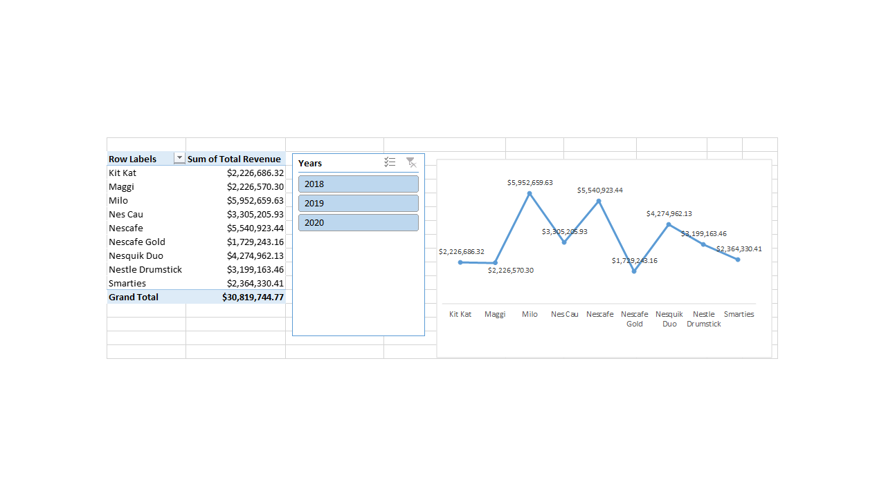
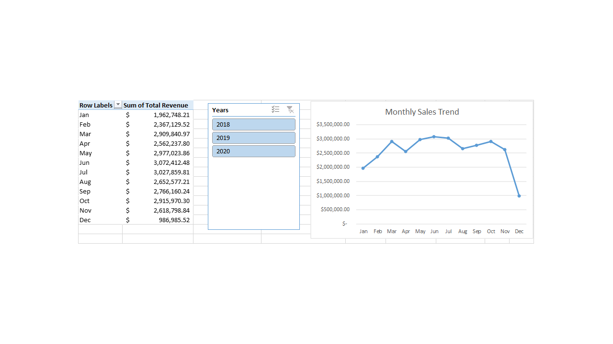
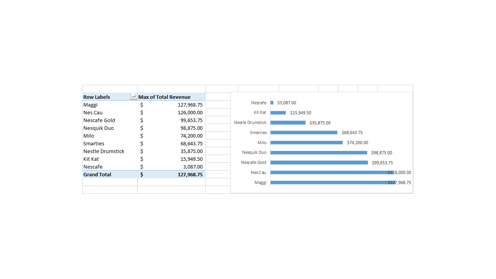
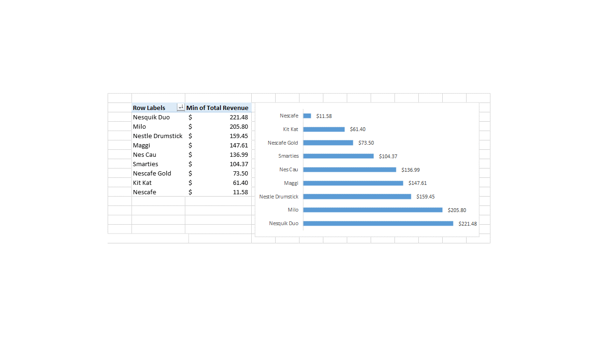
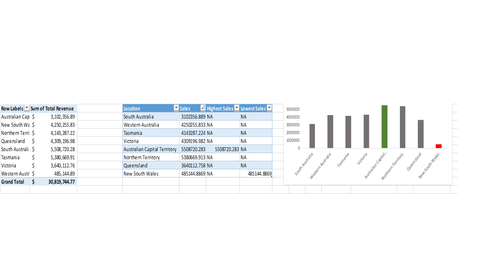
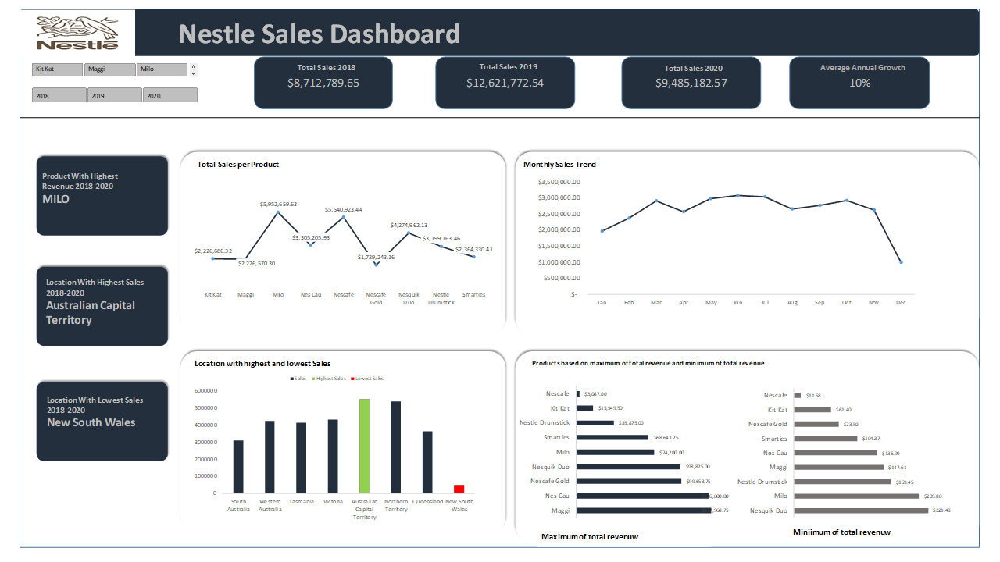

# Nestle Sales Analysis

## Introduction
This is an excel sales analysis project of **Nestle products**. The project is aimed at analyzing and deriving insights which show the performances of current products and help the company to make data driven decisions.

## Problem statement 
1. What is the trend of the total revenue per product in the last 3 years?
2. What is the monthly revenue trend?
3. Compare the different products based on the maximum and minimum revenue generated 
4. Which location had the highest and lowest sales?
5.Generate insights from the sales medium to help the head of growth take a decision.

## Skills/ Functions demonstrated;

The following **Excel** functions were used in this analysis:
- Power Pivot
- Vlookup Function
- If Function
- Max and Min Function
- Date Function

  ## Visualization
  Trend of total sales per products
  :-----------------------:
  
  This section presents an overview of the company's sales performance. In analyzing for revenue per product, no special function is required. We create a pivot table, put the products in rows and revenue in values, the result is then visualized using a column chart. This can then be filtered by the various years reqired.

  Monthly revenue trend
  :----------------:
  
  To extract the month from the dates, the **text function(=TEXT([@Date],"mmm"))** was used.  A pivot table is created with month in the rows and revenue in the value box. This gives a visual idea of revenue made per months. we can then see our revenue trends per month. 

  Maximum revenue  | Minimum Revenue
  :--------------:  | :-------------:
     |  
  
    The maximum and minimum revenue is also gotten by creating a **Pivot Table** with product and revenue, the value field settings is then changed to show maximum and minimum revenue.This gives the company adequate knowledge of the revenue performances of products.

   Location with the highest and lowest revenue
  :-------------------:
   
  In analyzing the location with the highest and lowest sale, we created a pivot table to summarize the data(revenue,location) needed for this analysis. To determine the location with highest and lowest revenue, I used **VlookUp(=VLOOKUP(L57,L57:M63,2,FALSE))** to create a table from the pivot table with columns for location and revenue after which I used the **IF, MAX and MIN function(=IF([@Sales]=MAX([Sales]),[@Sales],"NA"))**. This was then visualized using a column chart with distinct colours showing the locations with highest and lowest sales.

## Final report

**_Note_** _This Excel report is slicable by year and product_

#Insights and Conclusion
- Milo recorded the highest revenue between the period of 2018 - 2020
- Austrialian Capital Territory emerged location with the highest revenue.
- Average annual growth from 2018 - 2020 stood at 10%
- Extra resources should be allocated to products/locations with high revenues to maximize and capitalize on strong performance.

